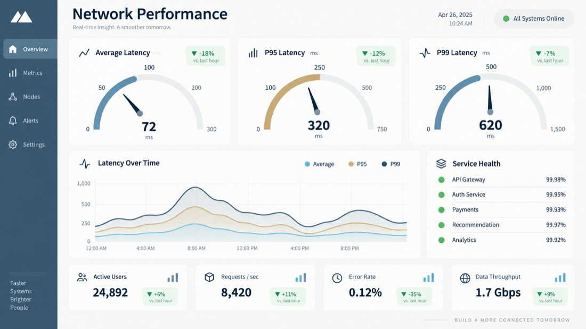

# AI API Aggregator Notes — image2.5 Alongside 60+ Models

What changes when one key reaches an **AI API aggregator** instead of a single vendor: shared auth, one task model for text and image jobs, provider failover, and cost accounting that stays per task.

**Attributed entry points:** [Open GPT Image 2.5 on APIMart](https://apimart.ai/model/gpt-image-2-5) · [Current pricing](https://apimart.ai/pricing) · [Endpoint documentation](https://docs.apimart.ai/en/api-reference/images/gpt-image-2.5-ext/generation)

## Contents

- [Model routes and IDs](#model-routes-and-ids)
- [Observed pricing](#observed-pricing)
- [What the output looks like](#what-the-output-looks-like)
- [Quickstart](#quickstart)
- [Request and response reference](#request-and-response-reference)
- [Where image2.5 sits in a multi-model pipeline](#where-image25-sits-in-a-multi-model-pipeline)
- [Failover rules that do not double-charge](#failover-rules-that-do-not-double-charge)
- [FAQ](#faq)
- [Attributed links](#attributed-links-how-this-repository-is-measured)
- [Repository map](#repository-map)

## The aggregator trade-off, stated plainly

An aggregator concentrates access: one base URL, one key, one billing surface, many models. You pay for that
convenience with provider-specific behaviour leaking through the abstraction.

What holds up in practice:

- **Shared auth and endpoints.** Text and image jobs both accept `Authorization: Bearer` against `https://api.apimart.ai/v1`.
- **One async contract.** A submitted job returns a task ID; polling looks the same whether the payload was a chat completion or an image2.5 render.
- **Catalog-level routing.** Swapping `gpt-image-2.5-ext` for another image model is a string change, which makes quality comparisons cheap.

What leaks through:

- **Parameter unions.** Each model accepts a slightly different subset (`quality` on the official route, `version` on the relayed one). Validate per model, not per gateway.
- **Price models differ.** Flat per-image routes sit next to token-billed endpoints, so budget reporting has to be per task, not per request.

## Model routes and IDs

| Route | `model` value | Selector | Billing style | Best for |
| --- | --- | --- | --- | --- |
| Official (token) | `gpt-image-2.5-flare` | n/a | token usage, `quality` low → max | everyday generation, batch drafts |
| Official (token) | `gpt-image-2.5-sunburst` | n/a | token usage, `quality` low → max | editing precision, production assets |
| Relayed (per image) | `gpt-image-2.5-ext` | `version: "flare"` | per delivered image (`n` ≤ 4) | high-volume generation at a flat price |
| Relayed (per image) | `gpt-image-2.5-ext` | `version: "sunburst"` | per delivered image (`n` ≤ 4) | edits and reference-driven work at a flat price |

Both relayed variants accept `resolution` `1K` / `2K` / `4K`, ten aspect ratios plus `auto`, and up to 16 reference images in `image_urls`. The official route adds exact pixel dimensions and the `low / medium / high / xhigh / max` quality ladder.

- Family: **GPT Image 2.5** — the OpenAI image generation and editing series served through APIMart
- Model IDs: `gpt-image-2.5-flare`, `gpt-image-2.5-sunburst` (official route); `gpt-image-2.5-ext` with `version: flare|sunburst` (per-image relay route)
- Base URL: `https://api.apimart.ai/v1` — OpenAI-compatible `POST /v1/images/generations`
- Async tasks: submit, then poll `GET /v1/tasks/{task_id}` until `status: completed`
- Output tiers: `1K`, `2K`, `4K`; up to 16 reference images for image-to-image; `n` ≤ 4
- Observed 1K price on the relayed route: **$0.0085 per delivered image** (checked 2026-09-16)

## Observed pricing

| version | 1K | 2K | 4K | billing unit |
| --- | --- | --- | --- | --- |
| `flare` | $0.0085 | $0.014 | $0.021 | per delivered image |
| `sunburst` | $0.0085 | check live pricing | check live pricing | per delivered image |

Per-image billing on the relayed route is charged for delivered images, and the task response reports the exact amount in `cost` / `credits_cost`, so the table above can be re-verified after a single paid call. The official `gpt-image-2.5-flare` / `gpt-image-2.5-sunburst` route is token-billed with a `low → medium → high → xhigh → max` quality ladder, which is why this repository keeps both the flat per-image expectation and the token-billed option side by side. Snapshot date: 2026-09-16.

## What the output looks like

Every render below came from a single `POST /v1/images/generations` call on the relayed route, at the aspect ratio shown.
| Output | Recipe | Use case | Version | Ratio | Prompt |
| --- | --- | --- | --- | --- | --- |
|  | Cinematic night street | Cinematic still | `flare` | 16:9 | `Rain-slicked Tokyo alley at night, neon sign reflections on wet asphalt, a lone cyclist with an umbrella, cinematic 35mm film still, shallow depth of field` |
|  | Fashion editorial portrait | Fashion | `flare` | 3:4 | `Fashion editorial portrait of a model wearing an oversized ivory trench coat, seamless light grey studio backdrop, crisp high key lighting, medium format detail` |
|  | Flat vector dashboard panel | Design / infographic | `sunburst` | 16:9 | `Flat vector dashboard panel with three gauge dials, abstract latency curves and clean geometric cards, muted blue and sand palette, generous white space, crisp vector edges` |
|  | Layered paper-cut illustration | Editorial illustration | `sunburst` | 4:3 | `Layered paper cut illustration of a mountain lake sunrise, five depth layers, soft pastel palette, subtle drop shadows, art print composition` |
|  | Game key art | Game concept art | `sunburst` | 16:9 | `Fantasy game key art, an armored knight standing on a floating stone ruin above a sea of clouds, dramatic backlight, painterly detail, wide cinematic composition` |
|  | Menu food photography | Food photography | `flare` | 4:3 | `Overhead flat lay of a spicy ramen bowl with a soft boiled egg, chopsticks resting on the rim, dark slate table, natural side light, editorial food photography` |

Every recipe ships with the exact JSON body in [`examples/`](examples).

## Quickstart

The relayed route is asynchronous: submit, then poll the task ID.

```bash
# text to image on the per-image route
IDEMPOTENCY_KEY="$(uuidgen)"
curl --request POST \
  --url https://api.apimart.ai/v1/images/generations \
  --header "Authorization: Bearer $APIMART_API_KEY" \
  --header 'Content-Type: application/json' \
  --header 'X-APIMart-Response-Version: 2026-07-27' \
  --header "Idempotency-Key: $IDEMPOTENCY_KEY" \
  --data '{
    "model": "gpt-image-2.5-ext",
    "version": "flare",
    "prompt": "A cozy reading nook beside a window on a rainy day, warm table lamp, cinematic lighting",
    "size": "1:1",
    "resolution": "1K",
    "n": 1
  }'
```

```python
import os, time, uuid, requests

BASE = "https://api.apimart.ai/v1"
HEADERS = {
    "Authorization": f"Bearer {os.environ['APIMART_API_KEY']}",
    "Content-Type": "application/json",
    "X-APIMart-Response-Version": "2026-07-27",
    "Idempotency-Key": str(uuid.uuid4()),   # reuse on retry, not on a new image
}

def generate(prompt: str, version: str = "flare", resolution: str = "1K", size: str = "1:1") -> str:
    r = requests.post(f"{BASE}/images/generations", headers=HEADERS, timeout=60, json={
        "model": "gpt-image-2.5-ext", "version": version, "prompt": prompt,
        "size": size, "resolution": resolution, "n": 1,
    })
    r.raise_for_status()
    task_id = r.json()["data"]["id"]
    while True:
        t = requests.get(f"{BASE}/tasks/{task_id}", headers=HEADERS, timeout=60).json()["data"]
        if t["status"] in ("completed", "failed"):
            return t
        time.sleep(5)
```

```javascript
const headers = {
  Authorization: `Bearer ${process.env.APIMART_API_KEY}`,
  "Content-Type": "application/json",
  "X-APIMart-Response-Version": "2026-07-27",
  "Idempotency-Key": crypto.randomUUID(),
};
const res = await fetch("https://api.apimart.ai/v1/images/generations", {
  method: "POST",
  headers,
  body: JSON.stringify({
    model: "gpt-image-2.5-ext", version: "flare", prompt: "A sky garden at dawn, architectural photography",
    size: "16:9", resolution: "1K", n: 1,
  }),
});
const { data } = await res.json();          // data.id === task id
// poll GET https://api.apimart.ai/v1/tasks/${data.id} until data.status === "completed"
```

Official (token-billed) route, for comparison — same path, no `version`, quality ladder instead:

```bash
curl --request POST --url https://api.apimart.ai/v1/images/generations \
  --header "Authorization: Bearer $APIMART_API_KEY" --header 'Content-Type: application/json' \
  --data '{"model":"gpt-image-2.5-sunburst","prompt":"Preserve the product label, replace the background with soft off-white, add a natural cast shadow","size":"1:1","resolution":"1k","quality":"high","n":1}'
```

Full field reference: [official route docs](https://docs.apimart.ai/en/api-reference/images/gpt-image-2.5-ext/generation) and the same attributed entry point for the ext route.

## Request and response reference (ext route)

| Field | Type | Default | Notes |
| --- | --- | --- | --- |
| `model` | string | required | `gpt-image-2.5-ext` |
| `version` | string | `flare` | `flare` or `sunburst` |
| `prompt` | string | required | must not be empty after trimming |
| `resolution` | string | `1K` | `1K`, `2K`, `4K` |
| `size` | string | `auto` | `auto` or 1:1, 16:9, 9:16, 4:3, 3:4, 3:2, 2:3, 5:4, 4:5, 21:9 |
| `n` | integer | `1` | 1–4 per request on the relayed route |
| `image_urls` | string[] | — | up to 16 references, URL or data URL, no extra charge |

Submission returns `202` with `data.id` (the task ID) and `data.poll_url`; `GET /v1/tasks/{task_id}` then reports
`status` (`pending` → `processing` → `completed` / `failed`), `progress`, `cost`, `credits_cost` and, when finished,
`result.images[].url` with an `expires_at` timestamp. Download outputs before that timestamp — the URLs are temporary.

## Where image2.5 sits in a multi-model pipeline

| Stage | Text models | Image stage |
| --- | --- | --- |
| Brief expansion | chat completions | — |
| Prompt hardening | chat completions with JSON output | — |
| Asset generation | — | `gpt-image-2.5-ext` (`flare` for volume, `sunburst` for edits) |
| QA / description | vision-capable chat model | — |
| Cost roll-up | per-task `cost` field on every job | per-task `cost` field on every job |

## Failover rules that do not double-charge

1. Classify the error first: `400` / `401` / `402` are terminal, `429` and `5xx` are retryable.
2. Retry with the same `Idempotency-Key` so a flapping upstream cannot invoice the same image twice.
3. Only cross-model fallback when the prompt is model-agnostic; a `sunburst` edit brief usually is not portable to another vendor.
4. Record the model ID and version next to every stored asset, or you cannot rebuild it later.


## FAQ

**What is an AI API aggregator?**

A single gateway that resells access to many models behind one key, one base URL and one billing account. Aggregators usually normalise the request shape but cannot fully normalise model-specific parameters or pricing models.

**Can one key really cover both text and image2.5 calls?**

Yes on APIMart: chat completions and `POST /v1/images/generations` share the same bearer key and task model, which is what makes a single pipeline possible.

**How do I compare an aggregator against direct vendor access?**

Run the same prompt set through both, record latency, per-task cost and rejection rate, then compare cost per *accepted* asset — the number that actually matters.

**Does aggregation weaken output quality?**

The model behaviour is upstream; the risks are parameter drift, a different safety layer and response-shape changes. Pin the response version header and verify one paid request per model before scaling.

## Related searches

- `image2.5 api`
- `image 2.5 api`
- `image2.5 api gateway`
- `image2-5 api`
- `gpt-image-2.5 api`
- `image2.5 api pricing`
- `ai api relay`
- `ai api gateway`
- `ai api aggregator`
- `apimart image2.5`
- `image2.5 api documentation`
- `openai compatible image api`
- `apimart`
- `image2 5`
- `image 2 5`
- `model catalog`

## Attributed links (how this repository is measured)

Every outbound link in this repository points at APIMart through a short link, so visits coming from this page are attributed instead of arriving as anonymous traffic.

| Purpose | Attributed link | Target |
| --- | --- | --- |
| Open GPT Image 2.5 on APIMart | <https://apimart.ai/model/gpt-image-2-5> | `apimart.ai/model/gpt-image-2-5` |
| Current APIMart pricing | <https://apimart.ai/pricing> | `apimart.ai/pricing` |
| Endpoint documentation (ext route) | <https://docs.apimart.ai/en/api-reference/images/gpt-image-2.5-ext/generation> | `docs.apimart.ai` |

- [ ] Attribution target: `go.apimart.ai` short links above (302 with `utm_source=kol_sponsor&utm_medium=sponsor`).
- [ ] Re-check the price on the pricing page before a production run: promotional routing can change.

## Disclosure

APIMart is the service described in this repository; this page is published to document it, not to claim official status. The `ext` route is a third-party relay endpoint billed per delivered image, while the `gpt-image-2.5-flare` / `gpt-image-2.5-sunburst` models are the token-billed route. Model names, prices and limits belong to their respective owners, and everything here is observation-dated (2026-09-16). Verify with a single paid request before scaling volume.


## Repository map

```text
ai-api-aggregator-image2.5/
  PROMPTS.md           every recipe with its output
  README.md            overview, pricing, quickstart and FAQ
  examples/
    curl.sh            submit + poll with curl
    python_generate.py end-to-end Python client
    javascript.mjs     Node 18+ equivalent
  tools/check_links.py attribution + prompt-data validator
  .github/workflows/validate.yml  CI for the validator
  assets/              example renders (JPEG, resized for the README)
  LICENSE              MIT
```

## License

MIT — see [LICENSE](LICENSE). Model names and vendor documentation remain the property of their owners.
